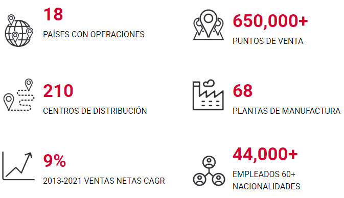
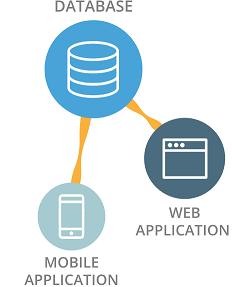
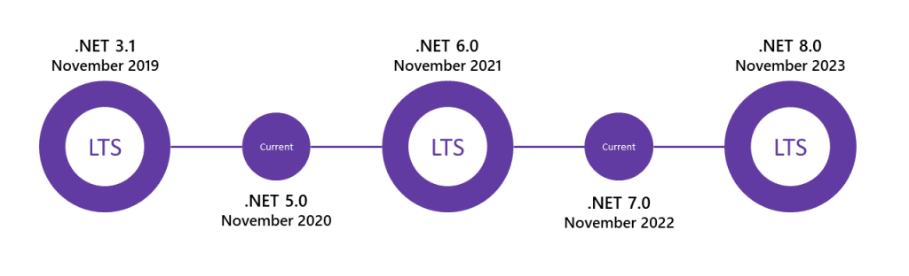

# Arquitectura Tecnológica: Aplicaciones

## Objetivo

El objetivo de este documento es mostrar brevemente el estado de la Arquitectura Tecnológica de Sigma hasta la fecha de escritura enfocado en las aplicaciones. El estudio revisa:

- Estilo de arquitectura de aplicaciones
- Estructura de aplicaciones
- Persistencia de datos
- Repositorio de código fuente
- Integración de código y despliegue de aplicaciones
- Repositorio de componentes
- Documentación
- Monitoreo
- Retroalimentación de clientes y usuarios finales

Adicionalmente en este estudio se expone una visión a futuro y un plan de viaje que nos permita como empresa ser más eficientes, flexibles y ágiles.

El reporte está estructurado en 3 partes principales:

- **¿ Qué es Sigma ?**
- **Hasta hoy**: Breve panorama del estado actual de las aplicaciones
- **Futuro**: Visión de como deberíamos estar en 2025  
- **Plan de viaje**: Un resumen del plan a 5 años

   

## ***¿ Qué es Sigma ?***

Somos una compañía global dedicada a ofrecer los alimentos favoritos de las comunidades. Con presencia en 18 países, ofrecemos productos de calidad en diversas categorías y precios.

 

 

Todo esto está soportado por un conjunto de aplicaciones, entre las que destacan:

| Aplicación          |                                             Función                                             |
| ------------------- | :---------------------------------------------------------------------------------------------: |
| SAP ERP             | Soporta operación en general en cuanto producción, materiales, facturación, datos maestros, etc |
| SAP CRM             |                           Soporta operación comercial (VAB, Preventa)                           |
| SAP NOM             |                                            are neat                                             |
| SAP BW              |                          Fuente y reportes de Inteligencia de negocios                          |
| Qlikview            |                             reportes para Inteligencia de negocios                              |
| SAP Commerce        | Soporta operación en general en cuanto producción, materiales, facturación, datos maestros, etc |
| Integraition Bus    | Soporta operación en general en cuanto producción, materiales, facturación, datos maestros, etc |
| RedPrairie (WMS     |                                 Soporta operación CADIs México                                  |
| Savanna             |                      Soporta operación CADI automatizado de Dulces Nombres                      |
| Móvil Telynet       |                               Soporta operación comercial México                                |
| Móvil HH (obsoleto) |                               Soporta operación comercial México                                |

   

## ***Hasta hoy***

  

### ***Estilo de arquitectura de aplicaciones***  

El estilo de arquitectura de aplicaciones que más aparece en el ecosistema actual es el de Cliente-Servidor. Las aplicaciones de este tipo tienen las siguientes características:

- No se separa lógica de negocio de repositorio de datos
- Por lo general estas aplicaciones se construyen manera monolítica
- Un cambio erróneo puede afectar a todo el sistema fácilmente
- Su tamaño en cuanto a líneas de código y funcionalidades las hace altamente complejas y difíciles de mantener.

 

 

Ejemplos de aplicaciones con este patrón:
- Flujos de viaje
- SAFYCC
- RedPrairie (WMS)
- POS Expendios Merksyst

  

### ***Estructura de aplicaciones***  

De manera general las aplicaciones hoy están compuestas por 2 elementos

- Aplicación cliente (lógica de presentación de la información)
- Servidor / Base de datos (lógica de negocio almacenamiento de datos)

Esto provoca que la interaccion entre aplicaciones no se base en un estandard y que se tengan que desarrollar interfaces ad-hoc para cubrir estas necesidades.

  

### ***Construcción de aplicaciones***  

Actualmente se utilizan alrededor de 10 lenguajes sobre al menos 13 frameworks para desarrollo de aplicaciones en Sigma

| Lenguaje   |      Plataforma      |                         Función                         |
| ---------- | :------------------: | :-----------------------------------------------------: |
| ABAP       |         SAP          |                       BAPI, RFCs                        |
| C#         | .Net 1.x  (obsoleto) | Web apps, servicios Windows, aplicaciones de escritorio |
| VB         | .Net 1.x  (obsoleto) | Web apps, servicios Windows, aplicaciones de escritorio |
| C#         | .Net 2.x  (obsoleto) | Web apps, servicios Windows, aplicaciones de escritorio |
| VB         | .Net 2.x  (obsoleto) | Web apps, servicios Windows, aplicaciones de escritorio |
| C#         | .Net 3.x  (obsoleto) | Web apps, servicios Windows, aplicaciones de escritorio |
| C#         |       .Net 4.x       | Web apps, servicios Windows, aplicaciones de escritorio |
| C#         |    .Net core 2.x     |                      Web apps, API                      |
| C#         |    .Net core 3.x     |                      Web apps, API                      |
| Java       |       JDK 8.0        |       Web apps, serivicios, flujos de integración       |
| Java       |      JDK 11.0+       |       Web apps, serivicios, flujos de integración       |
| JavaScript |      NodeJS 12       |                           API                           |
| JavaScript |       Angula 7       |                         We apps                         |
| Xamarin/C# |     .Net (mono)      |                       Mobile Apps                       |
| PHP        |         PHP          |                        Web apps                         |
| Python 3   |        Flask         |                 Analítica de datos, API                 |
| R          |          R           |            Analítica de datos, API, Web Apps            |

 
Esto provoca una gran complejidad para mantener o modificar aplicaciones existentes pues se tiene que contar con o contratar personal con dominio o 
conocimiento de tecnologías muy diversas.

No existe un estándar en cuanto herramientas de desarrollo y cada proyecto escoge las tecnologías que se van a utilizar.

  

### ***Persistencia de datos***  

Actualmente las aplicaciones almacenan muchos de sus datos en forma de archivos texto que se traspasan de un servidor a otro mediante una variedad de vías. Las formas de almacenamiento más comunes son:

 - Carpetas compartidas en servidores Windows.
 - Uso de FTP, SFTP y similares.
 - Uso de almacenamiento local

Se está empezando a utilizar otras formas de almacenamiento como:

- Servicios de nube (Azure storage account)
- Data Lake

Para persistencia en general de datos transaccionales se utilizan sistemas de bases de datos relacionales en su mayoría alguna de SQL Server (2000, 2005, 2008, etc.) y en páginas web de marcas se utiliza MySQL Server.

  

### ***Repositorio de código fuente***  

Actualmente algunas aplicaciones tienen su código fuente en un servidor de Team Foundation Service tecnología que el propio fabricante está dejando en favor de repositorios distribuidos Git

El resto de las aplicaciones se almacenan en carpetas en los servidores dedicados a la aplicación o en las computadoras personales de quienes participaron en el proyecto. Esto provoca que se tenga poco control y conocimiento de esta base de código fuente, incluso pudiera conducir a la pérdida por completo de este.  

  

### ***Integración de código y despliegue de aplicaciones***  

Para las aplicaciones alojadas en el servidor de Team Foundation Services el código se actualiza actualmente de manera manual y se generan versiones de los cambios. Las aplicaciones no alojadas en algún repositorio de código fuente se actualizan directamente en la carpeta de la aplicación y las versiones se llevan mediante archivos zip o copias de las carpetas, en el peor de los casos solo se sobrescribe perdiendo así la historia de cambios y haciendo más complicado un regreso a una versión anterior

Los desarrollos en las plataformas SAP se realizan a través del procedimiento de transportes entre ambientes con aprobaciones manuales

El resto de los desarrollos  se despliegan actualmente de manera manual, sobre servidores destinados a soportar los ambientes lo cual es complejo e involucra a personal de varias áreas. Esto lleva a que no sean tan frecuentes los despliegues, los cambios potencialmente más grandes y por tanto con un mayor riesgo de introducir algún error en producción 

  

### ***Repositorio de componentes***  

Actualmente no existe un repositorio de componentes comunes que se puedan reutilizar en las diferentes aplicaciones por lo que se duplica esfuerzo y lógicas de negocio por cada aplicación. Solamente las aplicaciones que conforman la Suite Sigma comparten componentes que evitan la reimplementación.

  

### ***Documentación***

Actualmente de las aplicaciones que cuentan con documentación esta se encuentra esparcida por diferentes repositorios o carpetas. No existe un repositorio central de documentación. 

  

### ***Monitoreo***

Actualmente el monitoreo de aplicaciones se realiza solamente desde la perspectiva tradicional de monitorear la infraestructura sobre la corren las aplicaciones y la vigilancia de la disponibilidad de los servicios mediante monitoreo de puertos específicos.

No existe telemetría adicional que ayude a determinar si es necesario hacer mejoras en el performance. 

  

### ***Retroalimentación de clientes y usuarios finales***

Actualmente la retroalimentación de usuarios finales se realiza a través de correo electrónico solamente en el caso donde ocurre un incidente en productivo o mediante requerimientos de clientes internos para mejoras o creación de aplicaciones.

Por otro lado, se liberan funcionalidades sin tener retroalimentación de los usuarios finales de si es algo que realmente resuelve un problema que tengan o si aporta valor, lo cual puede llevar a una menor adopción la aplicación.

    

## Futuro

  

### ***Estilo de arquitectura de aplicaciones***  

Se recomienda principalmente el uso de  Microservicios, que es un estilo de arquitectura de aplicaciones que divide una solución como una colección de servicios que cuando se diseñan correctamente son:

- Altamente sustentables
- Fáciles de probar
- Levemente acoplados (Loosely coupled)
- Desplegados de forma independiente
- Organizados por dominios del negocio
- Atendidos por pequeños equipos

 

 

 

Este estilo permite el despliegue rápido, frecuente y confiable de aplicaciones complejas y de gran tamaño. También permite a la Organización evolucionar su arquitectura tecnológica. Además, se va creando una base de servicios disponibles para su uso en aplicaciones futuras

  

### ***Estructura de aplicaciones***  

Para facilitar la flexibilidad de despliegue de las aplicaciones, vías de acceso estandarizadas a datos y facilidad de acceso a datos recomendamos que las aplicaciones
tengan 3 componentes

- Frontend (Aplicaciones Web y móviles): Lógica de experiencia de usuarios y presentación de datos.
- Middleware (APIs o servicios web): Lógica de flujos de negocio.
- Backend (bases de datos y sistemas core): Persistencia de datos y flujos de negocio legacy.

 

#### ***Frontend***  

Como premisa este tipo de componente de la estructura de aplicaciones encapsula toda la funcionalidad relacionada con la experiencia del usuario final y la presentación de datos. Depende totalmente de los sistemas de tipo middleware para su el acceso a datos almacenados en sistemas backend.

Están totalmente separados de los sistemas de tipo middleware y backend, por lo que se puede siempre desplegar en una plataforma de infraestructura diferente para mayor flexibilidad y escalabilidad. 

Ejemplos de sistemas Frontend:
- Aplicación web
- Aplicación móvil
- Bot
- Paquetes, controles o componentes reutilizables.
- Presentación de datos, Dashboards (Qlikview, Power BI)

 

#### ***Middleware***  

Como premisa este tipo de componente de la estructura de aplicaciones encapsula toda la lógica de negocio y abstrae a los sistemas de tipo frontend de la complejidad de los sistemas de backend. Es el punto de acceso a los datos almacenados en los sistemas de tipo backend.

Ejemplos de sistemas Middleware:
- API REST
- Serverless
- Servicio web SOAP
- Flujo de bus empresarial (IBM Integration Bus, Azure Logic Apps, SAP CPI)

 

#### ***Backend***  

Como premisa este tipo de componente de la estructura de aplicaciones se encarga de la persistencia, lectura y manipulación final de los datos en general. No deben exponer interfaces directas a los sistemas de tipo frontend, sino a través de sistemas de tipo middleware.

Son sistemas críticos, por tanto, debe garantizarse la integridad y calidad de los datos almacenados.

Ejemplo de sistema Backend:
- Base de datos relacional o no relacional
- Data Lake
- SAP BW
- SAP ERP
- SAP CRM

  

### ***Construcción de aplicaciones***  

Para poder enfocar mejor los esfuerzos se recomienda concentrar el conocimiento en los siguientes lenguajes de programación.

| Lenguaje | Plataforma |                  Función                   |
| -------- | :--------: | :----------------------------------------: |
| ABAP     |    SAP     |                 BAPI, RFCs                 |
| C#       | .Net 5.0+  | Web apps, API,  Mobile Apps (iOS, Android) |
| Python   | Python 3+  |             Analítica de datos             |
| R        |     R      |             Analítica de datos             |

 

Como herramienta para desarrollo se recomienda el uso de [Visual Studio Code](https://code.visualstudio.com/). El cual además de ser uno de los IDE más utilizados en la actualidad, es una herramienta Open-Source gratuita que no requiere inversión en licenciamiento y  cuenta con un sistema de extensiones que hace que se pueda cubrir fácilmente diferentes tecnologías. Adicionalmente la interfaz es la base para el futuro [Github Codespaces](https://github.com/features/codespaces) que nos va a permitir desplegar ambientes de desarrollo en nube listos para usar desde cualquier dispositivo.

  

### ***Persistencia de datos***  

Como premisa se aconseja evitar en la medida de lo posible:

 - Uso de carpetas compartidas en servidores Windows.
 - Uso de FTP, SFTP y similares.
 - Uso de almacenamiento local, excepto para el caso de procesamiento temporal.

Se recomienda para persistencia de archivos a largo plazo.

- Servicios de nube
- Data Lake

Para persistencia en general de datos transaccionales se recomienda uso de sistemas de bases de datos, tanto relacionales como no relacionales en dependencia de las necesidades de la aplicación. Se puede consultar una lista de los sistema de bases de datos soportados [aquí](https://ea.sigma-alimentos.com/platform.html#4.2.2.-data-bases).

  

### ***Repositorio de código fuente***  

Como repositorio central de código fuente se recomienda [Azure Repos](https://azure.microsoft.com/es-mx/services/devops/repos/) el cual es parte de la plataforma [Azure DevOps](https://azure.microsoft.com/es-mx/services/devops/) y está basado en [Git](https://git-scm.com/) que es el estándar mundial para repositorios de código distribuidos

  

### ***Integración de código y despliegue de aplicaciones***  

Como premisa la integración de código y despliegue de aplicaciones debe ocurrir de manera automática y como un proceso ágil que se puede reproducir cuantas veces se desee sin necesidad de movilizar personal para que ocurran.

Como plataforma para implementar estos procesos de integración y despliegue automatizado se recomienda [Azure Pipelines](https://azure.microsoft.com/es-es/services/devops/pipelines/) el cual es parte de la plataforma [Azure DevOps](https://azure.microsoft.com/es-mx/services/devops/) y cuenta con integración con la mayoría de plataforma de nube e infraestructura, además soporta una amplia variedad de tecnologías y cuenta con la posibilidad de extender la funcionalidad en caso que se necesite

Para el encapsulamiento de aplicaciones se recomienda el uso de contenedores para que nos permitan desplegar la aplicación de manera escalable y flexible en cualquier tipo de infraestructura: On-Premise, Nube o Híbrida. Recomendamos el uso de [Docker](https://www.docker.com/) para la creación de estos contenedores
  

### ***Repositorio de componentes***  

Para evitar la duplicación de desarrollos y potenciar la reusabilidad y la estandarización de flujos de negocio se se propone como premisa convertir la lógica funcional desarrollada en componentes o paquetes y ponerlos disponibles para  el uso de toda la Organización.

Ejemplo de funcionalidades que se pueden convertir en componentes:

- Login
- UI general de las aplicaciones
- Sistema de logs
- Controles como tablas, botones, filtros de datos, etc.
- Vías de acceder a datos

Como repositorio de componentes se recomienda el uso de [Azure Artifacts](https://azure.microsoft.com/es-es/services/devops/artifacts/) el cual es parte de la plataforma [Azure DevOps](https://azure.microsoft.com/es-mx/services/devops/) y soporta las tecnologías más importantes de manejo de paquetes (componentes): [Nuget](https://www.nuget.org/), [NPM](https://www.npmjs.com/), [Maven](https://maven.apache.org/index.html), etc.

  

### ***Documentación***

Se recomienda el uso de un repositorio de documentación centralizado y accesible para toda la Organización. En estos momentos se están realizando esfuerzos como [IT Book](https://itbook.sigma-alimentos.com)

Adicionalmente se debe implementar un catálogo de aplicaciones de preferencia enlazado o como parte del repositorio de  

  

## ***Monitoreo***

Se recomienda el uso de herramientas como [Dynatrace](https://www.dynatrace.com/) o [Application Insights](https://docs.microsoft.com/en-us/azure/azure-monitor/app/app-insights-overview) para monitorear el rendimiento real de las aplicaciones y tener una mayor visión de las áreas de oportunidad. Estas herramientas adicionalmente nos podrían brindar telemetría referente a la adopción y uso por parte de los usuarios finales de nuestras aplicaciones.

  

### ***Retroalimentación de clientes y usuarios finales***

Se recomienda la implementación de una aplicación para obtener feedback que se pueda incorporar en las demás aplicaciones y así facilitar a los usuarios finales proponer nuevas ideas y mejoras a las soluciones.

Adicionalmente se recomienda realizar los despliegues de nuevas versiones utilizando técnicas de [A/B testing](https://es.wikipedia.org/wiki/Prueba_A/B) para determinar lo que realmente tiene valor para los usuarios finales

    
## ***Plan de viaje***

  

### ***Estilo de arquitectura de aplicaciones***  

Todas las nuevas aplicaciones deben diseñarse con el estilo de Microservicios en primer lugar desde ahora. 

Se recomienda refactorizar o hacer nuevas versiones de  las aplicaciones que existen y sean viables para adaptarlas a este nuevo estilo de arquitectura.

  

### ***Estructura de aplicaciones***  

Todas las nuevas aplicaciones se deben construir con la estructura Frontend/Middleware/Backend a partir de ahora.

Se recomienda refactorizar o hacer nuevas versiones de  las aplicaciones que existen y sean viables para adaptarlas a esta nueva estructura.

  

### ***Construcción de aplicaciones***  

Comenzar lo antes posible capacitación de personal de Desarrollo de la Organización en los lenguajes y plataformas recomendados. También solicitar a las empresas consultoras que preparen personal para comenzar desarrollo en los lenguajes y plataformas recomendados a más tardar en el Q2 de 2021

En Q4 2021 prepararnos para cambiar imagen base de contenedores de aplicaciones a .Net 6.0 siguiendo este roadmap, con pocos o ningún cambio a las aplicaciones. El siguiente cambio de imagen base sería en Q4 2023.

 

 

### ***Persistencia de datos***  

Utilizar solamente las tecnologías recomendadas para almacenamiento de archivos en los nuevos desarrollos a partir de ahora

Se recomienda refactorizar o hacer nuevas versiones de  las aplicaciones que existen y sean viables para adaptarlas a estas tecnologías.

Capacitar al personal de Desarrollo de la Organización en los sistemas de bases de datos recomendados (relacionales y no relacionales) antes del Q3 2021 así como también uso de tecnologías basadas en nube.

Mantener investigación y revisión de evolución de lenguajes y plataformas tecnológicas para planear adopción anticipadamente de las que nos den valor a la Organización

  

### ***Repositorio de código fuente***  

Comenzar de manera inmediata a migrar las bases de código de Team Foundation Service a Azure Repos y en paralelo hacer una recopilación de los códigos fuentes que no tengan repositorio y alojarlos en dicho repositorio central en el transcurso de los siguientes 2 años

  

### ***Integración de código y despliegue de aplicaciones***  

Capacitar al personal de Desarrollo y Operaciones de la Organización  técnicas de DevOps y en implementación de pipelines de CI/CD automatizados, así como también en el uso de tecnologías basadas en nube.

Crear un equipo dedicado a la implementación y automatizaciones necesarias para todas las aplicaciones de la Organización

  

### ***Repositorio de componentes***  

Promover la cultura de creación de componentes que puedan servir a otras aplicaciones y de reutilizar componentes que ya existan antes de desarrollar nuevamente la lógica encapsulada en ellos

Crear una estrategia de Gobierno del repositorio de componentes antes de Q2 de 2021

  

### ***Documentación***

Dedicar personal para la captura de documentación esencial de aplicaciones en  [IT Book](https://itbook.sigma-alimentos.com)

Implementación de un catálogo de aplicaciones antes de Q2 2021

  

## ***Monitoreo***

Implementar [Dynatrace](https://www.dynatrace.com/) antes de Q3 2021 en infraestructura de microservicios y se recomienda extender a todo el ecosistema tecnológico posteriormente

  

### ***Retroalimentación de clientes y usuarios finales***

Implementar una aplicación para obtener feedback dentro de Suite Sigma que se pueda incorporar en las demás aplicaciones y así facilitar a los usuarios proponer nuevas ideas y mejoras a las aplicaciones antes de Q3 2021

Desarrollar procedimientos y prácticas para realizar despliegues de nuevas versiones utilizando técnicas de A/B testing antes de 2022

