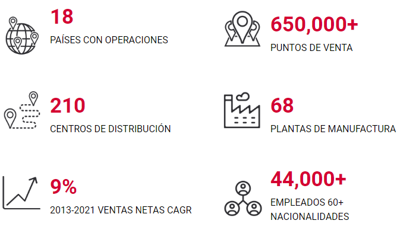
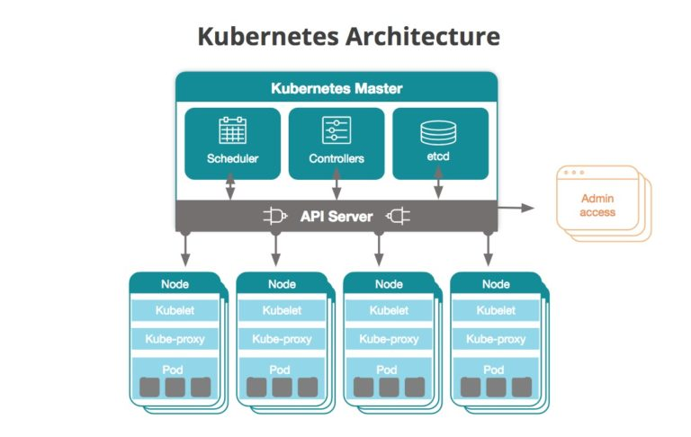

# Arquitectura Tecnológica: Infraestructura

## Objetivo

El objetivo de este documento es mostrar brevemente el estado de la Arquitectura Tecnológica de Sigma hasta la fecha de escritura enfocado en la infraestructura infórmatica Central, de Méxcio y de LATAM. El estudio revisa:

- Plataforma de Cómputo 
- Almacenamiento
- Despliegue de cargas de trabajo
- Nube
- Conectividad
- Monitoreo
- Soporte

Adicionalmente en este estudio se expone una visión a futuro que nos permita como empresa ser más eficientes, flexibles y ágiles.

El reporte está estructurado en 3 partes principales:

- **¿ Qué es Sigma ?**
- **Hasta hoy**: Breve panorama del estado actual de la infraestructura informática
- **Futuro**: Visión de como deberíamos estar en 2025

   

## ***¿ Qué es Sigma ?***

Somos una compañía global dedicada a ofrecer los alimentos favoritos de las comunidades. Con presencia en 18 países, ofrecemos productos de calidad en diversas categorías y precios.

 

 

Todo esto está soportado por la infraestructura informática, compuesta por:

- 20+ Centros de datos
- 3+ nubes privadas y 2 nubes públicas
- 600+ servidores
- Sistemas de almacenamiento
- Sistemas de redes informáticas  

   

## ***Hasta hoy***

  

### ***Plataforma de cómputo***  

 

Como Plataforma de Cómputo se utiliza mayormente servidores virtualizados sobre tecnología VMWare ESX, así como también en nube de Azure, y en menor medida servidores físicos o bare-metal. Se uiliza para sistemas "NO-SAP" y otras aplicaciones

- Flujos de aprobación
- Tu Portal Sigma
- Sitios Web
- Microservicios
- SAFYCC
- Clúster SQL Server
- Savanna WMS
- FastLabor
- File Servers / FTP Servers
- Servicio de impresión 

omo Plataforma de Cómputo para sistemas UNIX se utiliza servidores virtualizados sobre tecnología IBM Power (VIO Server). Esta plataforma brinda gran estabilidad y los CPU más potentes del mercado. Como desventaja tiene altos costos de hardware, software y mantenimientos, así como también alta complejidad de operación y poca compatibilidad con el universo de aplicaciones. Se utiliza para sistemas core como:

- SAP
- SAP CRM
- Sistema de Nóminas
- SAP BW
- RedPrairie WMS
- Flowcasting

La mayoría de los servidores utilizan versiones de sistemas operativos con licencias para su uso (Windows, AIX, Suse Linux, RedHat Linux) y solamente una minoría (menos del 10%) utiliza sistemas operativos Open-Source. Esto debido entre otras cosas a los requerimientos de las cargas de trabajo y a que el proveedor de servicios administrados (T-Systems) tiene como requerimiento el soporte de fabricante para incluir un servidor en su línea base. La siguiente figura muestra una distribución aproximada: 

La ventaja de esto es que ante un incidente se tiene el soporte de fabricante del sistema operativo con SLAs de alrededor de 2 horas de solución. 

La desventaja de esto es que anualmente se paga una cantidad importante en costos de licenciemiento solo de los sistemas operativos y tiene consecuencias como límites al crecimiento o vulnerabilidades ante auditorías de los fabricantes. 

  

### ***Almacenamiento***  

Acutalmente los datos se persisten los datos en sistemas de almacenamiento alojados físicamente en los centros de datos. En el centro de datos Central se utiliza mayormente sistemas de almacenamiento tipo SAN basados en tecnología Flash de la marca IBM. En los centros de datos regionales (Plantas, Almacenes, Corporativos) se utilizan sistemas de almacenamiento de tipo DAS basados en tecnología de discos magnéticos de 7200 rpm.    

  

### ***Despliegue de cargas de trabajo***  

En la actualidad el despliegue de cargas de trabajo se realiza de manera manual durante eventos de despliegue de nueva versión regidos por el proceso de Control de Cambios vigente (los cambios se anuncian con 1-2 semanas de anticipación). Por ejemplo:

- SAP ECC
- SAP CRM
- SAP BW
- Flujos de aprobación
- RedPrairie WMS
- FlowCasting
- Savanna
- TuPortal Sigma

Algunas cargas de trabajo se depliegan automáticamente a través de pipelines a sus ambientes de ejecución. Ejemplo de esto:

- B2B Fose (SAP Cloud)
- B2B Mex  (SAP Cloud)
- Suite Sigma 
- Ruteo Óptimo (API y Web)
- Plataforma comercial (API y Web)
- Páginas de Marcas (CafeOlé, Fud, etc.)

  

### ***Nube***  

### ****Nube Privada****  
Los sistemas más críticos se ejecutan principalmente sobre la nube privada de Sigma en el centro de datos Central en Monterrey.

### ****Nube Pública****  
Actualmente se tiene subscripción en las siguientes nubes:

- Azure: Bases de datos, Almacenamiento en nube, Sitios web, Datalake, Escritorios virtuales (VDI). 
- Google Cloud (GCP): Pricipalmente para acceso a APIs de Google Maps, Google Abnalitycs y mensajes móviles tipo Push (Firebase).
- SAP Cloud (HEC): B2B FOSE, B2B Mexico y SAP CPI

### ****Nube Híbrida****  

Algunas cargas de trabajo se corren en un esquema de nube híbrida donde participan el centro de datos central en Monterrey y la nube de Azure (region South Central US). Esta forma tiene la ventaja de poder colocar las cargas de trabajos donce más convenga por criterios como cercanía a los datos o capacidad de enlace de salida o alta disponibilidad. 

Este esquema es sobre todo utilizado por las aplicaciones basadas en contendores (API, Web, etc.) y por aplicaciones de IoT que trabajen con equipos en sitios internos de Sigma (Plantas, Almacenes, etc.). Por ejemplo:

- Suite Sigma 
- Ruteo Óptimo (API y Web)
- Plataforma comercial (API y Web)

  

### ***Conectividad***  

Internamente Sigma interconecta mediante Axtel (Alestra) los diferentes sitios: Datacenters, Plantas, Almacenes, Oficinas de Venta, Corporativos, etc basada en enlaces MPLS de diferentes capacidades, entre 10 - 1000 MBps. 

La conexión del datacenter principal en Monterrey con la nube de Azure es a través de un enlace directo (Azure ExpressRoute) de 100 MBps. Con los demás servicos de nubes en caso de existir es a través de VPN Site-to-Site.

El acceso de los usurios fuera de sitios de Sigma a la red interna es a través de VPN Point-to-Site PaloAlto Global Protect

  

### ***Monitoreo***  

Actualmente el monitoreo de cargas de trabajo se realiza a través de los sistemas que tiene implementado el proveedor de servicios administrados (T-Systems). Este monitoreo se realiza sobre los principales recursos de los servidores (CPU, memoria RAM, espacio en disco, etc.) y sobre la disponibilidad de puertos de red específicos. Con esto se monitorea una parte del escenario pues no incluye correlación con el desempeño de las aplicaciones o cargas de trabajo, datos que en caso de que se tengan son parte de sistemas distintos lo que hace más complejo tener una visión integral del status de la infraestructura informática. 

  

### ***Soporte***  

El soporte y atención a incidentes es proporcionado por el proveedor de servicios administrados (T-Systems). Los procesos están diseñados sobre las bases de metodologías de gestión como *ITIL* o frameworks como *COBIT*. Este servicio de soporte a operación mantiene la estabilidad de manera robusta pero no es ágil.

El soporte está estructurado por equipos de especialistas en ciertas areas: Servidores Windows, Servidores Linux, Servidores AIX, Almacenamiento, SAP Basis, Middleware, etc. Esta organización tiene el inconveniente que para la resolución de un problema debe implicarse a varios equipos los cuales no trabajan de forma conjunta, sino más bien en silos lo cual hace a veces que se tarde la solución 

Los cambios están sujetos a un proceso de control de cambios donde los cambios ordinarios por lo general toman entre 1 semana o 2 para su implementación y los cambios expeditos pueden ser ejecutados incluso el mismo día, estos últimos deben ser la excepción de la regla y estar bien fundamentados.

La atención de incidentes está basada en un proceso de tickets los cuales se mantienen abiertos durante todo el ciclo de resolución. El SLA crítco de es de 1 hora para respuesta y 2 para solución.

   

## ***Futuro***

  

### ***Plataforma de cómputo***  

 

Como Plataforma de Cómputo para sistemas x86 se recomienda el uso de pools de servidores x86 virtuales o bare-metal, con sistemas de manejo de contenedores como [Docker](https://www.docker.com/), [Containerd](https://containerd.io/) o [CRI-O](https://cri-o.io/) y  orquestados autonomamente por algún sistema como [Kubenetes](https://kubernetes.io/). Esto con el fin de maximizar las capacidades de hardware y romper la tradicional relación 1:1 que tenemos con aplicaciones y servidores asignados. La ventaja directa de esto es la disminución del número total de servidores, lo que incide directamente en el costo total de operacón. El esquema general de este escenario se representa en la siguiente figura:

Este esquema lo están siguiendo empresas como SAP cuya arquitectura actual se basa en desplegar cargas de trabajo en nube pública sobre servidores x86 con sistemas operativos Open-Source los cuales tienen instalados Docker y Kubernetes. Ejemplo de esto es la plataforma de SAP Commerce B2B México.

Sería factible revisar la posibilidad de migrar las cargas de trabajo de tipo core. Teniendo en cuenta que esta es la pataforma de cómputo que usa el fabricante de estos sistemas para brindar servicios de tipo Sofware-as-a-Service (SaaS) y Platform-as-a-Service (PaaS) a sus clientes. Este movimiento pudiera generar ahorros y aumentar la flexibilidad de los ambientes.

Se recomienda la migración paulatina de sistemas operativos con licenciamiento a sistemas operativos Open-Source como [Ubuntu Server 2004 (LTS)](https://ubuntu.com/server) para minizar el costos de licencias y mantenimiento. Este fabricante brinda planes de soporte flexibles para esquemas On-Premise y Nube. Con esto se estaría cumpliendo tambíen con el requisito del proveedor de Servicios Administrados (T-Systems).

  

### ***Almacenamiento***  

Para las cargas de trabajo que se deben seguir ejecutando en los centros de datos on-premise se recomienda el uso de sistemas de almacenamiento virtualizados tipo SAN basados en tecnología Flash. Esto garantiza la baja latencia de respuesta y maximizar las capacidades al multiplica por al menos por tres el tamaño real de disco adquirido.

Para cargas de trabajo que se deban ejecutar en sitios remotos se recomienda el uso de una mezcla entre discos tipo Flash/SSD y disco mecánicos para alcanzar la mejor relación redimiento-costos.

Por otro lado para servicios almacenamiento de grandes volúmenes de archivos se recomiendo el uso de servicos PaaS en nube como [OneDrive](https://www.microsoft.com/es-es/microsoft-365/onedrive/onedrive-for-business) o [Azure Files](https://azure.microsoft.com/es-mx/services/storage/files/).

  

### ***Despliegue de cargas de trabajo***  

Se recomienda continuar mejorando los proceso de depliegue automático a través de pipelines a sus ambientes de ejecución de las aplicaiones que ya lo realiza. Ejemplo de esto:

- B2B Fose (SAP Cloud)
- B2B Mex  (SAP Cloud)
- Suite Sigma 
- Ruteo Óptimo (API y Web)
- Plataforma comercial (API y Web)

Adicionalmente se debe contar con una manera de desplegar infraestructura de manera automática y on-demmand utilizando herrmientas como [Ansible](https://www.ansible.com/) o [Terraform](https://www.terraform.io/). De esta manera se puede llevar un control de versiones aplicando prácticas de [Infraestructura como Código](https://es.wikipedia.org/wiki/Infraestructura_como_c%C3%B3digo) (IaC) y automatizar los procesos de operaciones de TI. 

### ***Nube***  

### ****Nube Privada****  

Se recomienda su uso para:

- Cargas críticas que por razones legales o de cumplimiento no puedan ejecutarse en una nube pública como AWS, Azure o Google Cloud.
- Cargas que tengan que ejecutarse en sitios remotos IoT, control de maquinaria, etc

No se recomienda su uso para cualquier otro tipo de cargas de trabajo.

### ****Nube Pública****  

Se recomienda su uso para sistemas que requieran alta disponibilidad, alta trasferencia de volumenes de datos, escalar con facilidad o poder desplegarse de manera global en diferentes geografías.

### ****Nube Híbrida****  

Se recomienda su uso para sistema que requieran acceder de manera directa y  segura a sistemas y datos que se estén ejecutando en nube privada. Esto permite tener las ventajas de la nube privada y la nube pública. Se espera que en esta modalidad se encuentren la mayoría de las cargas de trabajo. 

 

En general se recomienda como estrategia disminuir la inversión en compra de hardware para nube privada que puede quedar obsoleto en algunos años (3-5 años generalmente) y aumentar la inversión en nube pública y nube híbrida. Esto con el fin de potenciar una operación de TI global en Sigma. También empezar a aplicar técnicas de multinube para no depender de un único proveedor Cloud.

  

### ***Conectividad***  

Es necesario evolucionar de una arquitectura basada en silos por geografía a una arquitectura globalmente distribuida que nos permita desplegar una misma aplicación en diferentes geografías. Para esto se recomienda:

- Crear un centro de datos en nube en la región de Azure Brasil

- Agregar conexiones de ExpressRoute desde Phoenix Arizona hacia la region Azure South Central y desde Lima hasta Azure Brasil.

- Establecer conexiones Site-to-Site entre todos los centros de datos en nube. 

- Dar seguimiento a la disponibilidad de Azure en los centros de datos en Querétaro(México), Phoenix(USA) y Madrid(Europa) para aprovecharlos como centros secudarios dada su cercanía con los datacenters on-premise de esas geografías

El siguiente esquema muestra como quedaría la interconexión entre datacenters de Sigma

  

### ***Monitoreo***  

Se recomienda el uso de plataformas que monitorean desde los servidores que ejecutan las cargas de trabajo hasta las acciones que realizan los usuarios con las aplicaciones. Se recomiendan herramientas como [Dynatrace](https://www.dynatrace.com/) o [Application Insights](https://docs.microsoft.com/en-us/azure/azure-monitor/app/app-insights-overview)/[Azure Monitor](https://azure.microsoft.com/es-mx/services/monitor/)

Las alarmas deben integrase de manera automática con la plataforma de manejo de incidentes que se utiliza en Sigma.

  

### ***Soporte***  

Se recomienda buscar con el proveedor de Servicios administrados maneras menos rígidas que se adapten mejor a las prácticas de agilidad. Con esquemas basados en métricas diferentes a las actuales, por ejemplo en requesto o page views en lugar de cantidad de servidores. Buscar un equipo de soporte versátil que puede atender un caso de extremo a extremo sin necesidad de hacer pases entre torres. 

   
